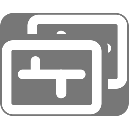
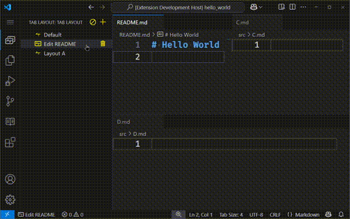
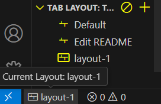

#  Tab Layout

Manage layouts in a workspace

## Features

- Manage layouts in a workspace
- Switch between saved layouts
- Show current layout name in status bar

    

### What information do a layout contain

- **Tab groups** and their **tabs**
- **Orientation** and **size** of each tab groups

### How layouts stored

Layouts are stored at `${workspaceRoot}/.vscode/layouts/${layoutName}.json`

- if any layout is selected, auto save to that active layout
- If no layout is selected, won't auto save

## Limitations

- Only available for single root workspaces, which is the most common use case.

## When clause context

| Key                    | Type    | Description                                                                                                                     |
| ---------------------- | ------- | ------------------------------------------------------------------------------------------------------------------------------- |
| `tab-layout.available` | boolean | Indicates whether the TabLayout extension is available for the current workspace (`true` when workspace has exactly one folder) |
| `tab-layout.enabled`   | boolean | Indicates whether a layout is currently active (`true` when there's an layout selected)                                         |
